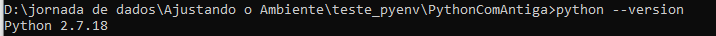
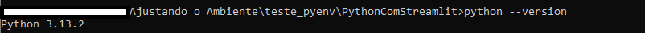

# Porque ter essas configurações? 
## Primeiramente 
Não queremos mais conversa de *"NA MINHA MAQUINA FUNCIONA"* 

## Segundamente
Quando tivermos uma atualização do python ou alguma outra biblioteca de seu projeto e ele deixe de utilizar uma função ou algo específico daquela versão, o seu projeto irá crashar, então para não ter que refatorar a cada versionamento ou revisar todo o código dos projetos a cada atualização, utilizamos um ambiente de versão onde para o porjeto funcionar, precisa ser executado com o ambiente da versão nova 

## Vamos começar? 

# Pyenv
## Para que serve?
Com  o pyenv conseguimos definir para cada um dos projetos uma versão específica, ele trabalha com variaveis de ambiente enganando o interpretador para usar a versão do arquivo configurado.

# Instalando o Pyenv

## Linux
Seguir o tutorial [pyenv](https://github.com/pyenv/pyenv)
## Windows
Seguir tutorial [pyenv-win](https://github.com/pyenv-win/pyenv-win)

>Caso o seu powerShel não premita executar o tipo de script para download é necessário habilitar. 
>Abra o powershell e execute o comando Get-ExecutionPolicy
>Se  ele responder Restricted então é necessário alterar para RemoteSigned
>
>`Set-ExecutionPolicy -ExecutionPolicy RemoteSigned -Scope CurrentUser`
>
>O RemoteSigned ele executa scripts e arquivos de configuração assinados por um fornecedor confiável e permite a execução de arquivos de configuração e/ou scripts locais.

Quando usamos pyenv versions nós vemos todas as versões de python instalados na maquina
No primeiro momento n vai mostrar nada, e é porque precisamos instalar as nosssas versões.
Vamos instalar a mais atual para o pyenv 3.13.2, na data de 23/04/2025, e colocar ela como global
>Primeiro comando
>`pyenv install 3.13.2`
>Segundo comando
>`pyenv global 3.13.2`

*Mesmo com a instalação global, não significa que não teremos que setar a nossa versão no nosso projeto*

## Vamos brincar agora criando alguns projetos? 
1 - Vamos instalar outras versões para testarmos. vamos instalar a 3.6.0 e a 2.7.18

`pyenv install 3.6.0`

`pyenv install 2.7.18`

Criaremos 3 projetos 
Cria uma pasta na área de trabalho: teste_pyenv
dentro dela criaremos 3 projetos:
- PythonComStreamlit
    - Aqui iremos colocar o pyhton 3.13.2
- PythonSemStreamlit
    - Aqui iremos colocar uma versão do pyhton 3.6.0 que não suporta o Streamlit 
- PythonComAntiga
    -  Aqui iremos utilizar o python 2.7.18

iremos navegar até elas pelo terminal.  
Se você criou na área de trabalho como falei o caminho deverá ser:
C:\Users\{SEU USUARIO}\Desktop\teste_pyenv

Para acessar a pasta então devemos fazer: 
cd C:\Users\{SEU USUARIO}\Desktop\teste_pyenv

# Vamos começar!
## PythonComStreamlit
Entrar na pasta do projeto: 

`cd PythonComStreamlit`

Colocar a versão que queremos:

`pyenv local 3.13.2`

Quando vemos a pasta tem um arquivo ``.python-version`` que é o arquivo onde a variável é definida

## PythonSemStreamlit
Entrar na pasta do projeto: 

`cd PythonSemStreamlit`

Colocar a versão que queremos:

`pyenv local 3.6.0`

Quando vemos a pasta tem um arquivo ``.python-version`` que é o arquivo onde a variável é definida

## PythonComAntiga
Entrar na pasta do projeto: 

`cd PythonComAntiga`

Colocar a versão que queremos:

`pyenv local 2.7.18`

Quando vemos a pasta tem um arquivo ``.python-version`` que é o arquivo onde a variável é definida

Feito isso, quando entramos numa pasta e damos o python version:

E Quando saímos dela... 

E pronto, temos o pyenv configurado na nossa máquina!! 
Vamos aprender agora sobre pip?