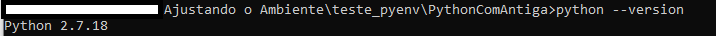

# Porque ter essas configurações? 
## Primeiramente 
Não queremos mais conversa de *"NA MINHA MAQUINA FUNCIONA"* 

## Segundamente
Quando tivermos uma atualização do python ou alguma outra biblioteca de seu projeto e ele deixe de utilizar uma função ou algo específico daquela versão, o seu projeto irá crashar, então para não ter que refatorar a cada versionamento ou revisar todo o código dos projetos a cada atualização, utilizamos um ambiente de versão onde para o porjeto funcionar, precisa ser executado com o ambiente da versão nova 

## Vamos começar? 

# Pyenv
## Para que serve?
Com  o pyenv conseguimos definir para cada um dos projetos uma versão específica, ele trabalha com variaveis de ambiente enganando o interpretador para usar a versão do arquivo configurado.

# Instalando o Pyenv

## Linux
Seguir o tutorial [pyenv](https://github.com/pyenv/pyenv)
## Windows
Seguir tutorial [pyenv-win](https://github.com/pyenv-win/pyenv-win)

>Caso o seu powerShel não premita executar o tipo de script para download é necessário habilitar. 
>Abra o powershell e execute o comando Get-ExecutionPolicy
>Se  ele responder Restricted então é necessário alterar para RemoteSigned
>
>`Set-ExecutionPolicy -ExecutionPolicy RemoteSigned -Scope CurrentUser`
>
>O RemoteSigned ele executa scripts e arquivos de configuração assinados por um fornecedor confiável e permite a execução de arquivos de configuração e/ou scripts locais.

Quando usamos pyenv versions nós vemos todas as versões de python instalados na maquina
No primeiro momento n vai mostrar nada, e é porque precisamos instalar as nosssas versões.
Vamos instalar a mais atual para o pyenv 3.13.2, na data de 23/04/2025, e colocar ela como global
>Primeiro comando
>`pyenv install 3.13.2`
>Segundo comando
>`pyenv global 3.13.2`

*Mesmo com a instalação global, não significa que não teremos que setar a nossa versão no nosso projeto*

## Vamos brincar agora criando alguns projetos? 
1 - Vamos instalar outra versão para Entendermos. vamos instalar a 2.7.18

`pyenv install 2.7.18`

Criaremos 2 projetos 
Cria uma pasta: teste_pyenv
dentro dela criaremos 2 projetos:
- PythonComStreamlit
    - Aqui iremos colocar o pyhton 3.13.2
- PythonComAntiga
    -  Aqui iremos utilizar o python 2.7.18

iremos navegar até elas pelo terminal.  
Caso não saiba fazer isso, fica aqui uma cheatsheet para isso:
[CheatSheet](https://www.cs.columbia.edu/~sedwards/classes/2015/1102-fall/Command%20Prompt%20Cheatsheet.pdf)

# Vamos começar!
## PythonComStreamlit
Entrar na pasta do projeto: 

`cd PythonComStreamlit`

Colocar a versão que queremos:

`pyenv local 3.13.2`

Quando vemos a pasta tem um arquivo ``.python-version`` que é o arquivo onde a variável é definida

## PythonComAntiga
Entrar na pasta do projeto: 

`cd PythonComAntiga`

Colocar a versão que queremos:

`pyenv local 2.7.18`

Quando vemos a pasta tem um arquivo ``.python-version`` que é o arquivo onde a variável é definida

Feito isso, quando entramos numa pasta e damos o python version:

E Quando saímos dela... 

Pyenv configurado. 
Vamos entrar um pouco mais nas soluções!!! 

# VENV
Primeiro de tudo: Segue a documentação: [Documentação venv](https://docs.python.org/pt-br/3/library/venv.html)

Aqui vamos entender o seguinte: 

Quando instalamos uma lib FORA da nossa pasta de projeto o nosso projeto NÃO vai conseguir utilizar as bibliotecas instaladas

*Por que?*

Porque realizamos a instalação da lib no pacote global de nossa máquina e não no da pasta, ou seja, ele irá usar uma versão daquela lib não suportada pela nossa versão do python

## Mas calma pequeno gafanhoto, vamos entender sobre venv
*Mas o que é Venv?*

venv é um módulo do python que permite a criação de ambientes virtuais 

>Sempre utilize um ambiente virtual para instalar as libs pelo pip na pasta de seu projeto.

Vamos começar? 
primeiramente, vamos acessar a pasta  de projeto PythonComStreamlit
e vamos executar esse comando : 
`python -m venv .venv`

>Vamos destrinchar o comando que fizemos : 
> 
>Python : Chama o interpretador do Python.
>
> -m : Essa flag permite que você execute um módulo como se fosse um script.
>
> venv :É o nome do módulo usado para criar ambientes virtuais.
>
> .venv :É o nome do diretório onde o ambiente virtual será criado.
> 
> Quero trazer uma observação para o .venv que é uma pratica já utilizada hoje em dia, você pode nomear do jeito que você quiser seu ambiente virtual, pode colocar o nome do papa

Se abrirmos nossa pasta, teremos a seguinte imagem: 

Precisamo também, ativar esse ambiente virtual, e fazemos com o seguinte comando: `.venv\Scripts\activate`

Com nosso ambiente criado, vamos instalar nossa biblioteca: 
`pip install streamlit`

Vamos fazer o mesmo com o outro projeto... 

## OPA! 

Como temos uma versão muito antiga do python não conseguimos utilizar o nosso ambiente virtual nele.
Da para instalar, da, mas precisa ser de outra maneira. 

Conseguimos ver aqui que os projetos estão melhor estruturados, pois não temos chance de ter uma quebra de código no meio do caminho. 

Se minha lib funciona no 2.7, mas eu estou sempre com a mais atual, uma hora terei que refatorar todo o meu código SEMPRE. E também evitamos o erro que queremos lá no começo: quando você testa em um ambiente, o ambiente que o coleguinha vai testar vai ser no mesmo ambiente instalado na sua pasta do python. 